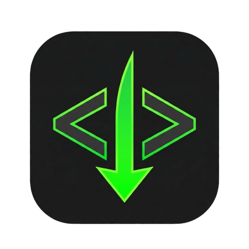

<p align="center">
  
</p>

# htmldrop

A single-file Flask app for sharing HTML pages and slideshow decks. Paste or upload HTML, get a shareable link instantly. Includes user accounts, an admin dashboard, and granular freeze controls.

## Features

- **Page sharing** — paste HTML or upload `.html`/`.htm` files, get a short link (`/p/<id>`)
- **Source remixing** — view the source of any page and fork it into a new one (`/p/<id>/source`)
- **Slide decks** — upload multiple HTML files or paste slides to create a full-screen slideshow (`/d/<id>`)
- **z.ai import** — create decks from pre-fetched z.ai slides via JSON API
- **User accounts** — email + password registration and login
  - Profile page listing your pages and decks with delete
  - Owner tracking — pages/decks are associated with the creating user
  - Activity logging — every action (login, share, delete, etc.) is recorded in `users.json`
- **Email verification** — users must verify their email before uploading
  - Verification link sent on registration and on demand from the profile page
  - Unverified users are blocked from creating pages and decks
- **Email notifications** — transactional emails for account events
  - Welcome email on account creation
  - Password change via email link (profile → email → set new password)
  - Email change via password verification (notification sent to old & new address)
  - Account blocked / unblocked / deleted by admin
  - Page or deck pinned / unpinned by admin
  - Account deletion via email confirmation link
  - Synchronous delivery for critical flows with "Please try again later" on failure
  - Fire-and-forget for notifications (welcome, blocked, etc.)
- **Admin dashboard** — password-protected panel to manage all content (`/admin`)
  - View/block/unblock/delete pages and decks
  - Pin a page or deck as the homepage hero
  - Tri-state freeze controls: **open** / **anon-only** / **all** for pages and decks
  - Freeze new user registration
  - Filter pages and decks by ID, title, or owner email
  - Hit counters and metadata per item
- **Rate limiting** — IP-based limits on content creation and auth endpoints via flask-limiter

## Routes

| Route | Description |
|---|---|
| `/` | Homepage |
| `/page` | Upload / paste HTML to create a page |
| `/share` | POST — create a new page |
| `/p/<id>` | View a shared page |
| `/p/<id>/source` | View page source / remix in editor |
| `/deck` | Create a slideshow deck |
| `/deck/create` | POST — save a new deck |
| `/deck/import-zai` | POST — import z.ai slides as a deck |
| `/d/<id>` | View a slideshow deck |
| `/register` | Create a new account |
| `/login` | User login |
| `/forgot-password` | Request a password reset link |
| `/logout` | POST — log out |
| `/profile` | View your pages, decks, and account settings |
| `/profile/resend-verification` | POST — resend email verification link |
| `/profile/request-change-password` | POST — send password change link |
| `/profile/change-email` | POST — change email (requires password) |
| `/profile/request-delete-account` | POST — send account deletion link |
| `/verify-email` | Verify email via token link |
| `/confirm-change-password` | Set new password via token link |
| `/confirm-delete-account` | Confirm account deletion via token link |
| `/admin` | Admin dashboard (admin login required) |

## Setup

### Requirements

- Python 3.8+
- Flask
- flask-limiter

### Install dependencies

```bash
pip install flask flask-limiter
```

### Run

```bash
python flask_app.py
```

The server starts on `http://0.0.0.0:5000`. Add `--debug` for hot-reload:

```bash
python flask_app.py --debug
```

## Configuration

Create a `.env` file in the project root (loaded automatically) or set environment variables:

| Variable | Default | Description |
|---|---|---|
| `SECRET_KEY` | `dev-secret-change-me` | Flask session secret key |
| `ADMIN_PASSWORD` | `password123` | Password for the admin dashboard |
| `SMTP_EMAIL` | *(required)* | Gmail address for sending emails |
| `SMTP_APP_PASSWORD` | *(required)* | Gmail app password for SMTP authentication |

The upload size limit is 10 MB (`MAX_CONTENT_LENGTH`).

### Freeze controls

From the admin dashboard you can set freeze modes per resource:

| Mode | Effect |
|---|---|
| **open** | Everyone can create |
| **anon** | Only logged-in users can create; anonymous visitors are blocked |
| **all** | Nobody can create |

Registration has a simple on/off toggle.

## Project Structure

```
flask_app.py        # Main application (routes, sanitization, auth, admin)
.env                # Environment overrides (SECRET_KEY, ADMIN_PASSWORD)
settings.json       # Runtime settings (freeze modes, pinned item)
users.json          # User accounts (hashed passwords, activity log)
meta.json           # Page metadata (hits, blocked status, owner, timestamps)
decks_meta.json     # Deck metadata
pages/              # Stored HTML pages (one file per page)
decks/              # Stored decks (one folder per deck with manifest + slides)
templates/          # Jinja2 templates
```

## License

[LICENSE](LICENSE)